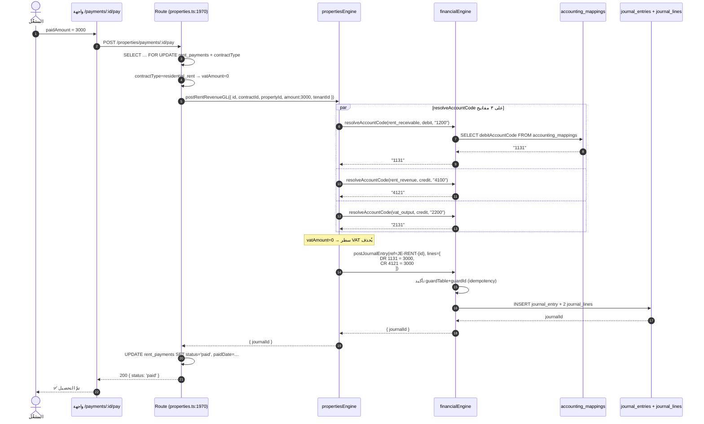
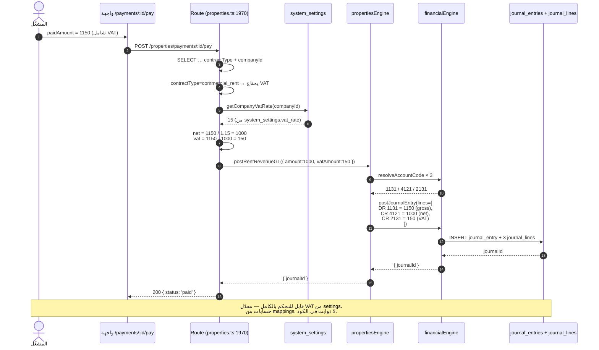
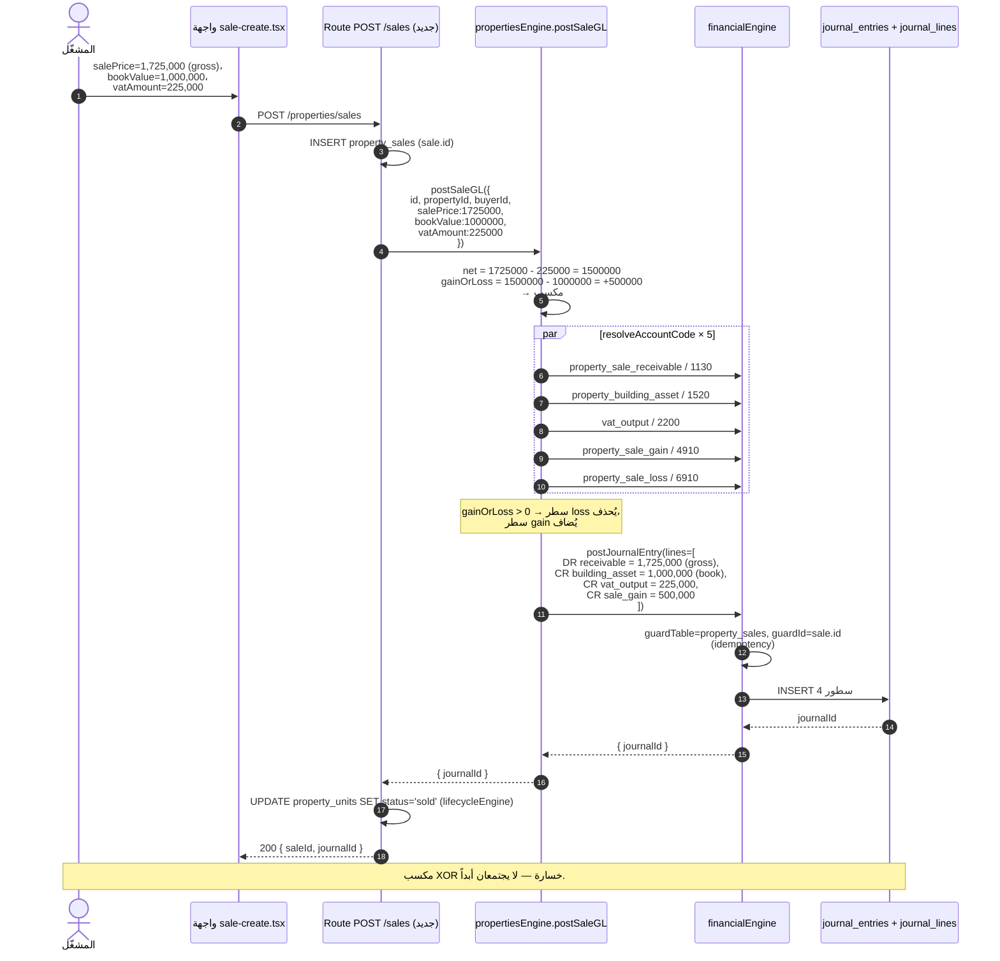
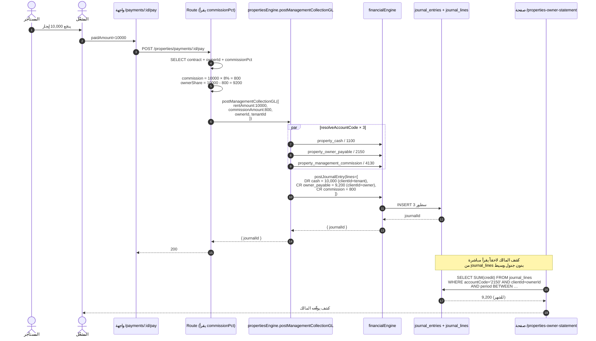
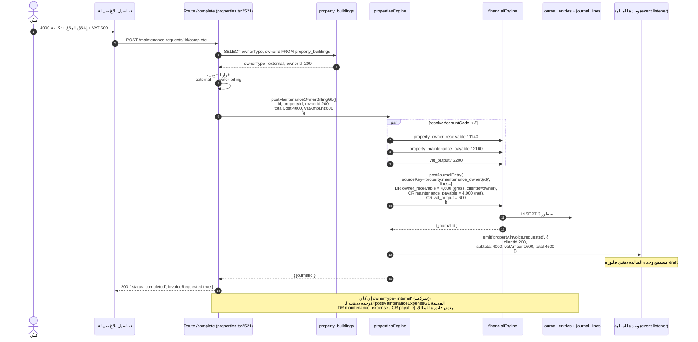

# 13 — المخططات التسلسلية للأشقاق الأربعة (ملحق لـ#2088)

> أربعة فروع نشاط، كل واحد عملية متكاملة UI → Route → Engine → Financial Engine → GL. المخططات بصيغة [Mermaid](https://mermaid.js.org/) — يعرضها GitHub تلقائياً في معاينة الـMarkdown.
> **الأطراف:** المشغّل (Operator) · الواجهة (UI) · راوتر العقارات (`properties.ts`) · المحرّك (`propertiesEngine`) · المحرّك المالي (`financialEngine`) · المخصصات (`accounting_mappings`) · الإعدادات (`system_settings`) · دفتر الأستاذ (`journal_entries / journal_lines`).
> **القاعدة الذهبية المرئية:** كل سهم يصل لـ`journal_entries` يمرّ عبر `propertiesEngine` ثم `financialEngine`. لا اختصارات.

---

## 1) إيجار سكني (`residential_rent`) — قبض دفعة

**العملية:** المشغّل يسجّل قبض إيجار سكني. لا VAT.

**ما تؤكّده رحلة E2E:** عدد سطور القيد = 2، DR=CR=3000، السطر الدائن بحساب 4121 (موجود فعلاً في `verify-property-rent-journey.sh`).

---

## 2) إيجار تجاري (`commercial_rent`) — قبض دفعة بـVAT (شقّ #2039 b-part)

**العملية:** نفس العملية الأولى، لكن المشغّل يدفع gross (شامل VAT)، والـRoute يقسم.

**معيار القبول للـb-part:** رحلة E2E تجاري تجد:
- 3 سطور قيد (لا 2).
- مجموع DR = 1150، CR = 1150.
- السطر `2131` بقيمة 150 موجود.

---

## 3) بيع عقار (`sale`) — استبعاد أصل + مكسب/خسارة (شقّ #2042 b-part)

**العملية:** المشغّل يسجّل بيع مبنى. الأصل يخرج بقيمته الدفترية، النقد يدخل بسعر البيع، الفرق مكسب أو خسارة.

**معيار القبول للـb-part:** رحلة E2E بيع تؤكّد:
- 4 سطور إن وُجدت VAT، 3 سطور بلا VAT.
- DR=CR على كل الأشكال.
- لا سطرَي مكسب وخسارة معاً.
- `property_units.status` يتحوّل إلى `sold` عبر `applyTransition`.

---

## 4) إدارة بعمولة (`management`) — التحصيل والكشف (شقّ #2043 b-part)

**العملية:** المستأجر يدفع، نقتطع عمولتنا، الباقي مستحق للمالك.

**معيار القبول للـb-part:**
- 3 سطور قيد، dimensions صحيحة (ownerId على سطر liability فقط، tenantId على cash).
- `commission = 0` يحذف سطر الـcommission (لا zero-amount).
- كشف المالك = aggregate من `journal_lines` لا جدول منفصل.

---

## 5) صيانة على المالك (`management` + ownerType=external) — شقّ #2044 b-part

**العملية:** صيانة في عقار نديره لمالك خارجي. التكلفة عليه (لا علينا)، فاتورة ضريبية له.

**معيار القبول للـb-part:**
- قرار التوجيه يقرأ `ownerType` فعلاً.
- `sourceKey` مختلف بين المسارَين (`property:maintenance:` vs `property:maintenance_owner:`) — فإعادة تصنيف بلاغ بعد إغلاقه تكتب JE جديداً بدون اصطدام idempotency.
- فاتورة المالك تُنشأ في وحدة المالية عبر event.

---

## 6) الأبعاد الموحّدة عبر الأربعة

كل سطر قيد ينتجه أي شقّ من الأربعة يحمل:

| البعد | المعنى | لمن |
|---|---|---|
| `propertyId` | معرّف المبنى (`property_buildings.id`) | كل السطور |
| `contractId` | معرّف العقد المرتبط | حيث ينطبق |
| `unitId` | معرّف الوحدة (`property_units.id`) | الصيانة والإيجار |
| `clientId` | المستأجر / المشتري / المالك | حسب الاتجاه: المستأجر على receivable الإيجار، المالك على owner_payable، المشتري على receivable البيع |

**النتيجة:** تقرير 360 لأي طرف (مالك، مستأجر، مشترٍ) يستخرج كل حركاته من `journal_lines` بـSELECT واحد filter بـ`clientId`.

---

## 7) قابلية التحكّم (لا ثوابت في الكود)

| القيمة | المصدر |
|---|---|
| معدّل VAT | `system_settings.vat_rate` per company |
| رموز الحسابات (5 لكل عملية) | `accounting_mappings` per company |
| نسبة العمولة | `rental_contracts.commissionPct` (PR-6b سيضيف العمود) |
| عتبات التصعيد للمتأخر | `system_settings.late_rent_*` (موجودة) |
| التوقيت في الـcron | `cron_jobs.scheduleCron` |
| سلاسل ترقيم المطبوعات | `numbering_assignments` |

**تغيير أي قيمة لا يحتاج redeploy.**

---

## 8) العقد الموثَّق بـtest-first

كل شقّ يحمل اختبار وحدة بنمط `vi.hoisted` يلتقط `lines[]` ويؤكّد:

| الشقّ | الاختبار |
|---|---|
| residential_rent | جزء من `propertyRentRevenueGL.test.ts` (#2039) |
| commercial_rent | الاختبار نفسه + arithmetic VAT |
| sale | `propertySaleGL.test.ts` (#2042) |
| management | `propertyManagementCommissionGL.test.ts` (#2043) |
| maintenance_owner | `propertyMaintenanceOwnerBillingGL.test.ts` (#2044) |
| building asset | `propertyUncoveredEngineFunctionsGL.test.ts` (#2094 — هذا) |
| early termination | نفس الملف (#2094) |
| owner payout | نفس الملف (#2094) |

**كل عقد قيد مُقفل قبل أي راوتر يلامس الكود الإنتاجي.**
